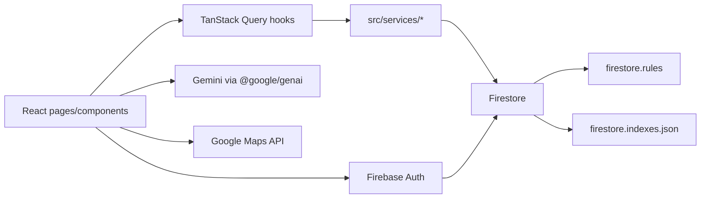

# ShowUp2Move ⚡

Platformă pentru coordonarea activităților sportive (evenimente + chat + “discover/swipe” + recomandări), construită cu **React (Vite)** pe frontend și **Firebase** ca backend (Auth + Firestore + Rules + Indexes + Analytics). AI-ul folosește **Google Gemini** prin `@google/genai`, cu răspunsuri **structurate JSON** și **timeout** ca UI-ul să nu “înghețe”.

---

## Tehnologii (stack)

- **Frontend**: React + Vite + TypeScript
- **Routing**: `react-router-dom`
- **Data fetching / cache**: TanStack Query (`@tanstack/react-query`)
- **Backend**: Firebase
  - **Auth**: Google Sign-In
  - **DB**: Firestore
  - **Observabilitate**: Analytics (`src/lib/analytics.ts`)
- **Hărți**: Google Maps (`@vis.gl/react-google-maps`)
- **Testare**: Vitest (+ coverage v8)

---

## TL;DR arhitectură

Aplicația este “single-page app” (SPA). “Backend”-ul este în mare parte Firebase (serverless managed), iar codul de integrare stă în `src/lib/*` și `src/services/*`.

Fluxul mare (simplificat):



---

## Structura proiectului (ce e unde)

- **`src/main.tsx`**: entrypoint React (mount în `#root`).
- **`src/App.tsx`**: compunerea aplicației:
  - provideri globali (TanStack Query, Maps, Auth),
  - routing,
  - lazy-loading pentru pagini (bundle inițial mic).
- **`src/contexts/AuthContext.tsx`**:
  - ascultă `onAuthStateChanged`,
  - creează profilul în Firestore la primul login,
  - ține profilul sincronizat live prin `onSnapshot`.
- **`src/lib/firebase.ts`**:
  - inițializează Firebase App + Firestore + Auth,
  - exportă `db` și `auth`,
  - centralizează logging-ul erorilor Firestore (`handleFirestoreError`).
- **`src/lib/analytics.ts`**: init analytics + helperi tipizați de tracking.
- **`src/hooks/useEvents.ts`**: hooks TanStack Query care consumă `eventService`.
- **`src/services/*`**: stratul de acces la date / integrare:
  - `eventService.ts` (events + join/leave + pagination + notificări),
  - `chatService.ts` (subcollection messages + polls + realtime),
  - `notificationService.ts` (subcollection notifications + realtime),
  - `followingService.ts` (social graph),
  - `availabilityService.ts`, `sportsService.ts` etc.
- **`src/pages/*`**: ecranele (Landing, Home, Discover, Events, EventDetail, Profile).
- **`firestore.rules`**: securitate (Auth + validări + permisiuni).
- **`firestore.indexes.json`**: indexuri necesare pentru query-uri compuse.

---

## “Backend”-ul: cum funcționează (Firebase)

### Autentificare

- Login-ul se face prin **Google Sign-In** (popup).
- Starea de auth e globală prin `AuthProvider`.
- La primul login:
  - se creează document în `users/{uid}` (profil).
  - apoi profilul este ținut sincronizat în timp real.

Fișier relevant: `src/contexts/AuthContext.tsx`.

### Baza de date (Firestore): model de date

Colecții principale (vezi `src/constants/index.ts`):

- **`events`**: evenimentele sportive
  - status: `proposed | confirmed | completed | cancelled`
  - participanți: `participants: string[]`
  - captain: `captainId`
- **`users`**: profilele utilizatorilor
- **`availabilities`**: disponibilitate pe zile

Subcolecții:

- **`users/{userId}/following/{followedUserId}`**: social graph (“following”)
- **`users/{userId}/notifications/{notificationId}`**: notificări in-app
- **`events/{eventId}/messages/{messageId}`**: chat (realtime) + polls

Tipurile sunt definite în `src/types/index.ts`.

### Securitate (Rules)

Regulile din `firestore.rules`:

- **Default deny** pe tot (`allow read, write: if false;`) și apoi “whitelist” pe colecții.
- Protecții cheie:
  - `users/{userId}`: create/update doar owner.
  - `events/{eventId}`:
    - read doar dacă ești logat,
    - update join/leave permis doar dacă update-ul e valid (diferență de listă participanți),
    - update detalii permis doar pentru captain.
  - `events/{eventId}/messages/*`: acces doar pentru participanți (verifică event-ul cu `get()`).

### Indexuri

`firestore.indexes.json` include indexuri compuse pentru query-uri precum:

- `events` filtrat după `status` + ordonat după `time`
- `events` după `status + sport + time`
- `availabilities` după `userId + date`

Dacă adaugi query-uri noi cu mai multe `where()` + `orderBy()`, probabil vei avea nevoie de index nou.

---

## Frontend-ul: cum curge datele

### Routing + lazy loading

`src/App.tsx` face lazy-load la pagini (Home/Profile/Events/EventDetail/Discover). Asta scade bundle-ul inițial: userul vede repede Landing/Loading, iar paginile “grele” se descarcă la navigare.

### Fetching, cache și refresh

Hook-urile (ex. `useEvents`) folosesc TanStack Query:

- caching cu `staleTime` (30s),
- refetch automat pe focus,
- invalidare explicită după mutații (join/leave/create).

---

## AI (Gemini): cum e folosit și ce să știi

`src/services/geminiService.ts` centralizează AI:

- fiecare funcție trimite prompt + schema JSON,
- parsează răspunsul,
- este protejată cu `withTimeout` (10s).

### Important (securitate)

În forma curentă, cheia `GEMINI_API_KEY` este folosită în client. Pentru producție e recomandat:

- să muți apelurile Gemini într-un backend (ex. Cloud Functions / server propriu),
- sau să pui măsuri stricte (rate limit / App Check / proxy).

(În roadmap ai deja direcția asta.)

---

## Config / variabile de mediu

Acest proiect are nevoie (minim) de:

- **Google Maps**: `VITE_GOOGLE_MAPS_PLATFORM_KEY` (vezi `src/App.tsx`)
- **Gemini**: `VITE_GEMINI_API_KEY` (vezi `src/services/geminiService.ts`)

Și are și fișierul de config Firebase:

- `firebase-applet-config.json` (importat de `src/lib/firebase.ts`)

---

## Comenzi utile

Instalare:

```bash
npm install
```

Dev server:

```bash
npm run dev
```

Build:

```bash
npm run build
```

Testare:

```bash
npm run test
```

Coverage:

```bash
npm run test:coverage
```

Typecheck (lint):

```bash
npm run lint
```

---

## Troubleshooting (rapid)

- **“permission-denied” în Firestore**:
  - verifică dacă ești logat,
  - verifică `firestore.rules`,
  - uită-te în console la output-ul din `handleFirestoreError()` (include uid și path).
- **Nu se încarcă harta**:
  - lipsește `VITE_GOOGLE_MAPS_PLATFORM_KEY` sau e invalidă,
  - `App.tsx` arată un ecran special “Google Maps API Key Required”.
- **AI nu răspunde**:
  - verifică `GEMINI_API_KEY`,
  - există timeout de 10s; UI nu ar trebui să blocheze.

---

## Data flows pe pagini (ce se cheamă unde)

### Landing (`src/pages/Landing.tsx`)

- **Scop**: gate de autentificare (dacă `user === null`).
- **Dependențe cheie**:
  - `useAuth()` → `signIn()` pornește Google popup.

### Home / Dashboard (`src/pages/Home.tsx`)

- **Citește**:
  - evenimente active (prin `useEvents()` → `eventService.fetchAllActiveEvents()` → `events`)
  - profilul curent (din `AuthContext` → `users/{uid}`)
- **Scrie**:
  - disponibilitate (dacă pagina o gestionează) → `availabilities`
  - tracking analytics (helperi din `src/lib/analytics.ts`)

### Discover (`src/pages/Discover.tsx`)

- **Scop**: swipe pe evenimente potrivite utilizatorului.
- **Citește**:
  - `usePotentialMatches(userId)` → `eventService.fetchPotentialMatches(userId)`
    - citește profil user (`users/{uid}`) pentru `sportsInterests`
    - listează evenimente active (`events`)
  - `followingService.getFollowing(userId)` (dacă UI prioritizează “friends”)
- **Scrie**:
  - tracking swipe (ex. `trackSwipe`)

### Events (`src/pages/Events.tsx`)

- **Citește**:
  - listă evenimente → `events`
- **Scrie**:
  - create event → `eventService.createEvent()` → `events`
  - opțional: “AI suggest” titlu/locație → `geminiService.suggestEventTitle()` / `geminiService.suggestVenue()`

### EventDetail (`src/pages/EventDetail.tsx`)

- **Citește**:
  - event by id → `eventService.getEvent(eventId)` → `events/{eventId}`
  - chat realtime → `chatService.subscribeToMessages(eventId)` → `events/{eventId}/messages/*`
- **Scrie**:
  - join/leave → `eventService.joinEvent()` / `eventService.leaveEvent()`
    - update `events/{eventId}.participants`
    - posibil update `events/{eventId}.status` la confirmare
    - create notificări → `users/{captainId}/notifications/*` sau către toți participanții la confirmare
  - chat: send message/poll/vote → `chatService.*` → `events/{eventId}/messages/*`
  - AI:
    - compatibilitate → `geminiService.getCompatibilityScore()`
    - balance teams (captain) → `geminiService.balanceTeams()`
    - translate chat → `geminiService.translateChat()`

### Profile (`src/pages/Profile.tsx`)

- **Citește**:
  - profil curent (realtime) → `users/{uid}` (prin `AuthContext`)
- **Scrie**:
  - update profil → `userService.updateProfile()` → `users/{uid}`
  - AI extract interests → `geminiService.extractInterests()`

---

## Deploy / Hosting (opțiuni recomandate)

### Opțiunea A — Firebase Hosting (clasic pentru Vite SPA)

**Când e bună**: vrei hosting simplu + CDN + integrare naturală cu Firebase.

- **Build**:

```bash
npm run build
```

- **Inițializează hosting** (din root):

```bash
npx -y firebase-tools@latest init hosting
```

Setări recomandate:
- **public directory**: `dist`
- **single-page app rewrite**: **YES** (important pentru `react-router-dom`)

- **Deploy**:

```bash
npx -y firebase-tools@latest deploy --only hosting
```

### Opțiunea B — Vercel / Netlify (static hosting)

**Când e bună**: vrei deploy rapid + preview deployments + CI simplu.

Setări tipice:
- **Build command**: `npm run build`
- **Output directory**: `dist`
- **SPA fallback/rewrite**: `/* → /index.html` (ca routing-ul să funcționeze la refresh)

### Opțiunea C — Hosting + backend pentru AI (recomandat pentru producție)

**Când e bună**: vrei ca `GEMINI_API_KEY` să nu ajungă în browser.

Arhitectură:
- frontend static (Hosting/Vercel/Netlify)
- endpoint server-side (Cloud Functions / Cloud Run / server propriu) care cheamă Gemini
- clientul cheamă endpoint-ul, nu direct Gemini

## Roadmap (următorul nivel)

- Mutarea logicii AI în backend (Cloud Functions) ca să nu expui cheia
- Firebase App Check (anti-abuse)
- Notificări push (FCM)
- Optimizare “fetchAllProfiles” (paginare / query server-side)
